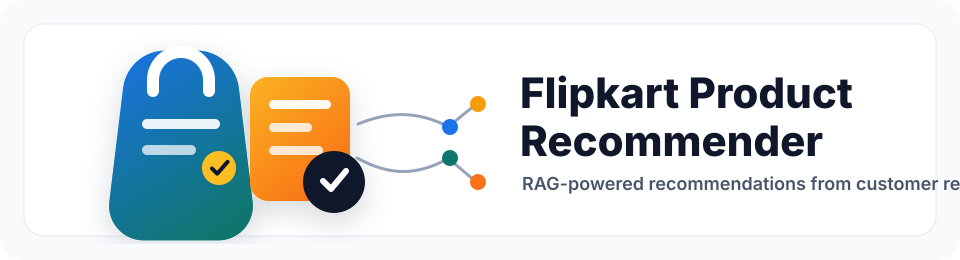
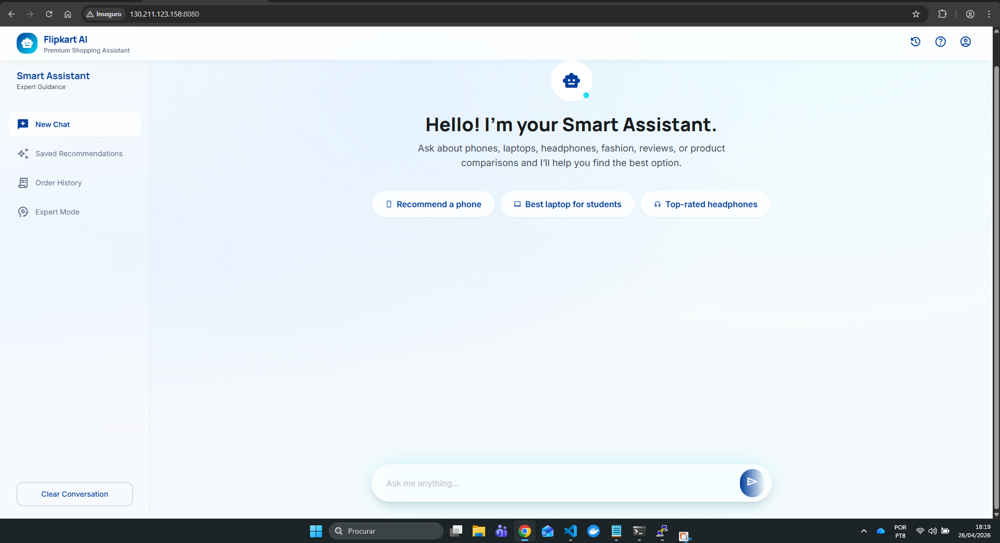
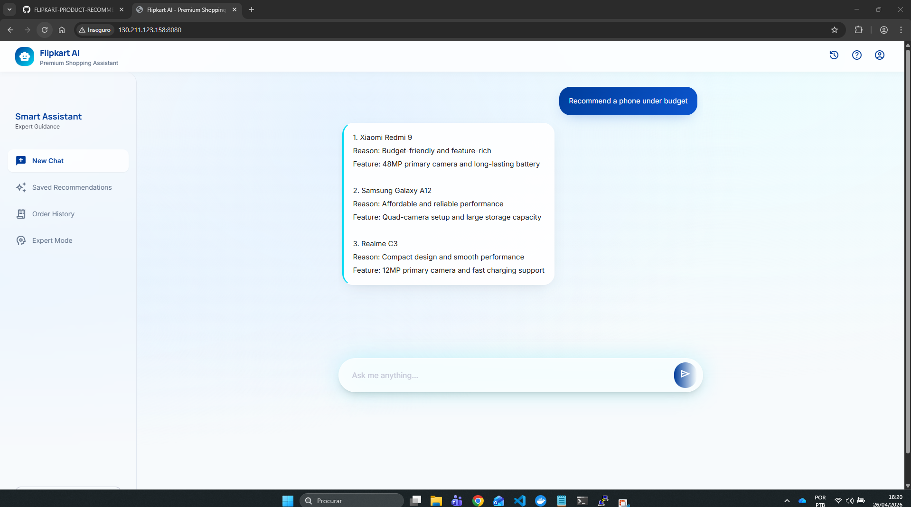
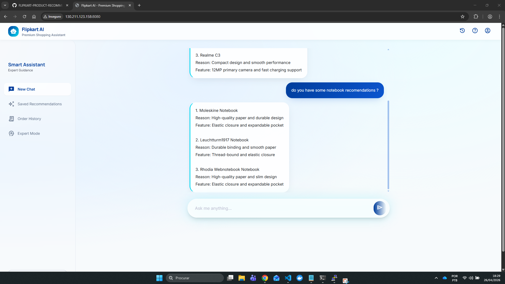

<div align="center">
  

  <p>
    <b>RAG-powered product recommendation assistant built with LangChain, ChromaDB, Flask, Groq, and Hugging Face embeddings.</b>
  </p>

  <p>
    
    
    
    
    
  </p>
</div>

## Overview

Flipkart Product Recommender is an end-to-end LLMOps project that recommends products from Flipkart customer reviews using Retrieval-Augmented Generation (RAG). The application converts review data into documents, stores semantic embeddings in ChromaDB, and uses a conversational LangChain pipeline to answer product-related questions through a Flask web interface.

The project also includes production-oriented pieces such as Docker packaging, Kubernetes manifests, Prometheus metrics, and Grafana deployment files.

## Application Preview

### Web Interface



### Chat Recommendation Flow



### Follow-up Product Questions



## Features

- Conversational product recommendation assistant
- RAG pipeline using LangChain retrieval chains
- ChromaDB vector store with persisted embeddings
- Hugging Face embedding model support
- Groq-hosted LLM for response generation
- Flask web UI for user interaction
- `/metrics` endpoint for Prometheus scraping
- Dockerfile for containerized execution
- Kubernetes manifests for app, Prometheus, and Grafana deployment

## Architecture

```text
User
  |
  v
Flask Web App
  |
  v
LangChain Conversational RAG Chain
  |
  +--> History-aware Retriever
  |       |
  |       v
  |     ChromaDB Vector Store
  |       |
  |       v
  |     Flipkart Review Embeddings
  |
  v
Groq LLM Response
  |
  v
Product Recommendation Answer
```

## Tech Stack

| Area | Tools |
| --- | --- |
| Backend | Python, Flask |
| AI orchestration | LangChain |
| LLM | Groq, Llama 3.1 8B Instant |
| Embeddings | Hugging Face `BAAI/bge-base-en-v1.5` |
| Vector database | ChromaDB |
| Data | Flipkart product review CSV |
| Observability | Prometheus, Grafana |
| Deployment | Docker, Kubernetes |

## Project Structure

```text
.
+-- app.py                         # Flask application entry point
+-- flipkart/
|   +-- config.py                  # Environment and model configuration
|   +-- data_converter.py          # Converts product reviews into documents
|   +-- data_ingestion.py          # Builds or loads the ChromaDB vector store
|   +-- rag_chain.py               # Conversational RAG chain
+-- Data/
|   +-- flipkart_product_review.csv
+-- chroma_db/                     # Persisted local vector database
+-- templates/                     # Flask HTML templates
+-- static/                        # CSS and frontend assets
+-- img/                           # README application screenshots
+-- prometheus/                    # Prometheus Kubernetes manifests
+-- grafana/                       # Grafana Kubernetes manifests
+-- Dockerfile
+-- flask-deployment.yaml
+-- requirements.txt
+-- setup.py
```

## Getting Started

### 1. Clone the repository

```bash
git clone https://github.com/<your-username>/<your-repository>.git
cd <your-repository>
```

### 2. Create and activate a virtual environment

```bash
python -m venv venv
venv\Scripts\activate
```

On macOS or Linux:

```bash
python -m venv venv
source venv/bin/activate
```

### 3. Install dependencies

```bash
pip install -r requirements.txt
```

Or install the project in editable mode:

```bash
pip install -e .
```

### 4. Configure environment variables

Create a `.env` file in the project root:

```env
GROQ_API_KEY=your_groq_api_key
HUGGINGFACEHUB_API_TOKEN=your_huggingface_token
```

Optional variables are also supported in `flipkart/config.py` for Astra DB experiments:

```env
ASTRA_DB_API_ENDPOINT=
ASTRA_DB_APPLICATION_TOKEN=
ASTRA_DB_KEYSPACE=
```

### 5. Run the application

```bash
python app.py
```

Open the app in your browser:

```text
http://localhost:5000
```

Prometheus metrics are available at:

```text
http://localhost:5000/metrics
```

## Docker

Build the image:

```bash
docker build -t flipkart-product-recommender .
```

Run the container:

```bash
docker run --env-file .env -p 5000:5000 flipkart-product-recommender
```

## Kubernetes Deployment

The repository includes Kubernetes manifests for the Flask app, Prometheus, and Grafana.

Apply the Flask deployment:

```bash
kubectl apply -f flask-deployment.yaml
```

Apply Prometheus resources:

```bash
kubectl apply -f prometheus/
```

Apply Grafana resources:

```bash
kubectl apply -f grafana/
```

Before deploying, make sure the required API keys are available as a Kubernetes secret named `llmops-secrets`.

## Observability

The Flask app exposes a Prometheus-compatible metrics endpoint at `/metrics`. The current implementation tracks total HTTP requests using `prometheus_client.Counter`.

Grafana can be used to visualize Prometheus metrics after the monitoring stack is deployed.

## Example Prompts

```text
Recommend the best wireless earbuds based on customer reviews.
```

```text
Which products have good battery backup?
```

```text
Suggest budget-friendly Bluetooth headsets with good sound quality.
```

## Roadmap

- Add automated tests for ingestion and RAG responses
- Add Docker Compose for local app, Prometheus, and Grafana execution
- Improve UI with product cards and rating highlights
- Add CI/CD workflow for linting and deployment validation
- Add configurable retriever parameters

## License

This project is intended for educational and portfolio purposes. Add a license file before using it in production or distributing it publicly.

## Author

Eduardo dos Santos Sousa. Built as part of an LLMOps and AIOps learning project.
